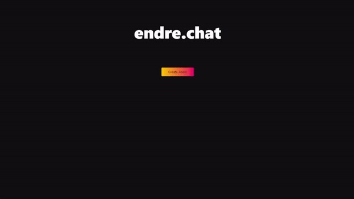

# endre.chat

Welcome to endre.chat, our submission for the SvelteHack hackathon! We're excited to introduce our fun and engaging chat web application with a twist. Using the power of GPT-4 AI, we transform messages before they're sent, creating a unique and entertaining chatting experience.



## [Demo](https://endre.chat/)

## Features

- Real-time chatting with other users
- AI-assisted message transformation using GPT-4
  Fun and engaging chat themes
- Mobile-friendly design
- Built with Svelte for a sleek and fast user experience

## How It Works

When you send a message with endre.chat, our system processes your message using GPT-4 AI. The AI then transforms your message, adding its own creative twist while still retaining the original meaning. This transformed message is what gets sent to the chat room, creating a fun and engaging experience for all users.

---

## Development

### Configuration

Configuration needs to be passed in via environment variables.
You can use the provided [.env-example](./.env-example) file as a starting point.

| Environment Variable | Description               |
| -------------------- | ------------------------- |
| SESSION_SECRET       | Key for cookie encryption |
| DATABASE_URL         | Prisma database URL       |
| OPENAI_API_KEY       | OpenAI API Key            |

To start the development server, run:

```bash
npm run dev
```

### Building

To create a production build of your app, run:

```bash
npm run build
```

You can preview the production build with `npm run preview`.

### Database Setup

To migrate the database schema and seed the database from `prisma/seed.js`, run:

```
npm run db:migrate
```

Run the above command whenever you add a new model schema to `prisma/schema.prisma`.

### NixOS shenanigans

- Use minimal shell.nix
- Use specific Prisma version https://github.com/prisma/prisma/issues/17070#issuecomment-1468642092
